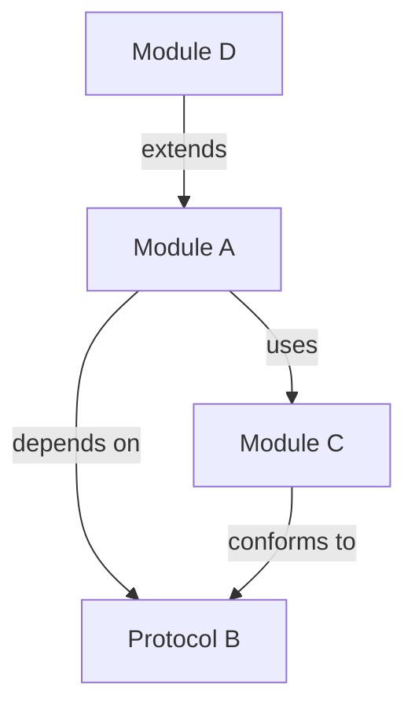

# Session Workflow & Context Recovery Protocol

**Purpose:** Ensure seamless context recovery and project continuity across AI sessions.

> **The Problem:** LLMs lose context between sessions. Without a protocol,
> each new session starts from scratch, potentially violating established
> architectural decisions or repeating resolved work.
>
> **The Solution:** Treat documentation as persistent memory. Every session
> ends with a checkpoint; every session starts by reading that checkpoint.

---

## Session Lifecycle

```
┌─────────────────────────────────────────────────────────────┐
│                    SESSION LIFECYCLE                        │
│                                                             │
│   ┌──────────────┐                                          │
│   │ SESSION START │──→ Context Recovery Protocol            │
│   └──────────────┘     (Read hierarchy, confirm readiness)  │
│          │                                                  │
│          ▼                                                  │
│   ┌──────────────┐                                          │
│   │ ACTIVE WORK  │──→ Design-First TDD                      │
│   └──────────────┘     (Design → Test → Implement → Doc)    │
│          │                                                  │
│          ▼                                                  │
│   ┌──────────────┐                                          │
│   │ SESSION END  │──→ Handover Protocol                     │
│   └──────────────┘     (Update state, create summary)       │
│          │                                                  │
│          ▼                                                  │
│   ┌──────────────┐                                          │
│   │ NEXT SESSION │──→ Reads summary, resumes exactly        │
│   └──────────────┘                                          │
│                                                             │
└─────────────────────────────────────────────────────────────┘
```

---

## Part 1: Session Start — Context Recovery Protocol

When starting a new session or recovering from a lost context window, the AI must read documents in the appropriate hierarchy:

### Recovery Tiers

Choose the appropriate recovery level based on the task:

| Tier | When to Use | Documents to Read |
|------|-------------|-------------------|
| **Quick Recovery** | Bug fixes, small changes, resuming same-day work | Latest summary + active checklists |
| **Full Recovery** | New sessions, complex features, after long breaks | All 5 documents in order |

### Quick Recovery (2 documents)

For small tasks where project vision and rules are already familiar:

```
1. Latest file in 05_SUMMARIES/                → Where we left off
2. 04_IMPLEMENTATION_CHECKLISTS/CURRENT_*.md   → Active tasks
```

After reading, confirm: *"Quick context recovered. Resuming [task]. Following Zero Warnings Gate."*

### Full Recovery (5 documents)

### Reading Order (MANDATORY)

```
Vision → Constraints → State → History
```

| Order | Document | Purpose |
|-------|----------|---------|
| 1 | `00_MASTER_PLAN.md` | Understand project mission, users, priorities |
| 2 | `01_CODING_RULES.md` | Know forbidden patterns, safety requirements |
| 3 | `09_TEST_DRIVEN_DEVELOPMENT.md` | Understand testing contract, determinism rules |
| 4 | `04_IMPLEMENTATION_CHECKLISTS/CURRENT_*.md` | See current In Progress and Blocked tasks |
| 5 | Latest file in `05_SUMMARIES/` | Catch up on exact stopping point |

### Context Recovery Prompt Template

Use this prompt to initialize a new AI session:

```markdown
We are resuming work on **SwiftMCPClient**. Please initialize your context
by reading the following documents in order:

1. **00_MASTER_PLAN.md**: Project mission, target users, current priorities
2. **01_CODING_RULES.md**: Forbidden patterns, division safety, Swift 6 concurrency
3. **09_TEST_DRIVEN_DEVELOPMENT.md**: LLM implementation contract, deterministic randomness
4. **../04_IMPLEMENTATION_CHECKLISTS/CURRENT_*.md**: Active feature checklists
5. **The latest file in 05_SUMMARIES/**: Exact stopping point from last session

Detect hardware profile and provide a 3-sentence summary of our current
objective. Confirm you are ready to follow the Zero Warnings/Errors Gate.
```

### Hardware Profile Detection

Claude should automatically detect hardware during context recovery. Do not ask the user for this information.

**macOS:**

```bash
cores=$(sysctl -n hw.ncpu)
chip=$(sysctl -n machdep.cpu.brand_string 2>/dev/null || system_profiler SPHardwareDataType | grep "Chip" | awk -F': ' '{print $2}')
ram=$(( $(sysctl -n hw.memsize) / 1073741824 ))
gpu=$(system_profiler SPDisplaysDataType | grep "Chipset Model" | awk -F': ' '{print $2}' | head -1)
echo "${cores}-core ${chip}, ${ram}GB RAM${gpu:+, ${gpu} GPU}"
```

**Linux:**

```bash
cores=$(nproc)
cpu=$(grep -m1 "model name" /proc/cpuinfo | awk -F': ' '{print $2}')
ram=$(( $(grep MemTotal /proc/meminfo | awk '{print $2}') / 1048576 ))
gpu=$(lspci 2>/dev/null | grep -i "vga\|3d" | awk -F': ' '{print $2}' | head -1)
echo "${cores}-core ${cpu}, ${ram}GB RAM${gpu:+, ${gpu}}"
```

**Use hardware profile for:**
- Parallelization limits (e.g., `swift test --parallel --num-workers 8`)
- Performance benchmark baselines
- Memory-intensive operation planning

### AI Confirmation Response

After reading documents and detecting hardware, the AI should confirm:

```markdown
**Context Recovered:**
1. Project: [Name] — [One-line mission]
2. Current Task: [From active implementation checklist]
3. Last Session: [Summary of where we left off]

**Hardware Profile:** [auto-detected] — [parallelization recommendation]

**Constraints Acknowledged:**
- Zero warnings/errors gate: ✅
- Deterministic randomness: ✅
- No force unwraps: ✅
- Design proposal required for non-trivial features: ✅

Ready to proceed.
```

---

## Part 2: Active Work — Design-First TDD

During active development, follow the workflow defined in:
- [Design Proposal Phase](05_DESIGN_PROPOSAL.md)
- [Implementation Checklist Template](../04_IMPLEMENTATION_CHECKLISTS/TEMPLATE.md)
- [Test-Driven Development](09_TEST_DRIVEN_DEVELOPMENT.md)

> **Workflow:** See [Implementation Checklist Template](../04_IMPLEMENTATION_CHECKLISTS/TEMPLATE.md) for the full Design-First TDD cycle.

### Key Rules During Active Work

1. **Design Before Code:** Propose architecture for non-trivial features
2. **Tests Before Implementation:** Write failing tests first
3. **Zero Tolerance:** No warnings, no test failures, no unsafe patterns
4. **Document As You Go:** DocC comments immediately after implementation
5. **Track Progress:** Update Implementation Checklist as tasks complete

---

## Part 3: Session End — Handover Protocol

Before ending any session, complete the handover protocol to ensure the next session can resume seamlessly.

### Handover Checklist

```markdown
**Session End Checklist:**

- [ ] **Quality Gate Passed:** `quality-gate` shows all checks green
- [ ] **State Updated:**
  - [ ] Active checklist in `../04_IMPLEMENTATION_CHECKLISTS/CURRENT_*.md` updated
  - [ ] `00_MASTER_PLAN.md` — updated if architecture changed
- [ ] **File Hygiene:** `zzz In Process/` cleared — no orphaned temporary files
- [ ] **Session Summary Created:**
  - [ ] New file in `05_SUMMARIES/` using template
  - [ ] Filename: `YYYY-MM-DD_TaskName.md`
  - [ ] All sections completed
```

### Session End Prompt Template

Use this prompt to trigger proper session closure:

```markdown
We are ending this session. Please perform the handover tasks:

1. **Verify Quality Gate:** Run `quality-gate` and report status
2. **Update State Files:**
   - Move completed tasks in active implementation checklist
   - Update `00_MASTER_PLAN.md` if we made architectural changes
3. **Create Session Summary:** Write a new file in `05_SUMMARIES/` including:
   - Work Completed (with test names, files modified)
   - Quality Gate Status (from quality-gate output)
   - Immediate Next Step (exact starting point for next session)
   - Pending Blockers (unresolved issues)
   - Context Loss Warnings (things the next session might forget)
```

### Session Summary Template

See: [SESSION_SUMMARY_TEMPLATE.md](../05_SUMMARIES/SESSION_SUMMARY_TEMPLATE.md)

---

## Part 4: Context Loss Prevention

### Why Context is Lost

| Cause | Prevention |
|-------|------------|
| Long conversation exceeds context window | Create checkpoint summaries mid-session |
| New session starts fresh | Always run Context Recovery Protocol |
| Architectural decisions forgotten | Document in Master Plan and Session Summary |
| Implicit assumptions | Make everything explicit in documentation |

### Mid-Session Checkpoints

For very long sessions, create intermediate checkpoints:

```markdown
**Mid-Session Checkpoint:**
- Work completed so far: [List]
- Current focus: [What we're working on now]
- Key decisions made: [List with rationale]
- Tests passing: [Count]
- Next step: [Immediate action]
```

### Critical Context to Preserve

Always document these explicitly — they're most likely to be forgotten:

1. **Why** something was done (not just what)
2. **Rejected alternatives** and why they were rejected
3. **Concurrency model** choices (actor vs struct, etc.)
4. **Seeds used** for stochastic tests
5. **External dependencies** and version constraints

---

## Part 5: Quick Reference

### Session Start Checklist
- [ ] Read documents in order (Vision → Constraints → State → History)
- [ ] Provide 3-sentence context summary
- [ ] Confirm Zero Gate commitment
- [ ] Identify immediate task from Implementation Checklist

### Session End Checklist
- [ ] All quality checks pass
- [ ] Implementation Checklist updated
- [ ] Session Summary created in `05_SUMMARIES/`
- [ ] Immediate next step clearly documented

### Emergency Context Recovery

If context is completely lost mid-conversation:

```markdown
"I've lost context. Please re-read:
1. The latest file in `05_SUMMARIES/`
2. `04_IMPLEMENTATION_CHECKLISTS/CURRENT_*.md` — current tasks
3. Any files we modified this session: [list them]

Then summarize where we are and what we were doing."
```

---

## Part 6: Phase Summaries (Project State Sync)

As the project grows, individual session summaries may become insufficient for context recovery. Create **Phase Summaries** to consolidate state:

### When to Create a Phase Summary

- **Every 10 sessions** — Consolidate recent work
- **Upon completing a Roadmap Phase** — Document milestone achieved
- **Before major architectural changes** — Snapshot current state

### Phase Summary Location

Store in: `05_SUMMARIES/05_00_PHASE_SUMMARIES/`

Filename format: `YYYY-MM-DD_Phase[N]_[PhaseName].md`

### Phase Summary Contents

````markdown
# Phase [N] Summary: [Phase Name]

**Date Range:** [Start Date] to [End Date]
**Sessions Covered:** [Count]

## Objectives Achieved
- [Major feature 1] — complete with tests and docs
- [Major feature 2] — complete with tests and docs

## Architectural Decisions Made
| Decision | Rationale | Session |
|----------|-----------|---------|
| [Choice made] | [Why] | YYYY-MM-DD |

## Quality Gate Status
- Warnings: 0
- Test Failures: 0
- Concurrency Errors: 0

## Next Phase Priorities
1. [Next major objective]
2. [Next major objective]

## Dependency / Knowledge Graph

> Include a Mermaid.js diagram showing how modules, protocols, and key types
> relate to each other. This gives the next session a visual map that prose
> summaries alone cannot convey. Mermaid renders natively in GitHub, many IDEs,
> and is understood by Claude.



## Context Loss Risks
- [Complex decisions that might be forgotten]
- [Implicit assumptions that should be explicit]
````

This prevents "context fragmentation" where the AI knows recent history but loses track of broader phase objectives.

---

## Part 7: File Hygiene & Context Management

As projects span months or years, documentation files can bloat and overwhelm the LLM context window. Follow these rules to keep files approachable.

### File Size Limits

| File Type | Max Size | Action When Exceeded |
|-----------|----------|---------------------|
| Session summaries | ~150 lines | One per session (already enforced) |
| Implementation checklists | ~100 lines each | One per feature, archive when shipped |
| Master plan | ~300 lines | Split decisions to separate log |
| Design proposals | ~150 lines each | Archive after feature ships |
| Phase summaries | ~100 lines | One per phase, not cumulative |

### Archival Structure

Create archive folders to move completed/historical content:

```
04_IMPLEMENTATION_CHECKLISTS/
├── CURRENT_Median.md                   ← Active feature checklist
├── CURRENT_StandardDev.md              ← Active feature checklist
├── 04_99_COMPLETED/
│   ├── 2024-03-01_Mean.md              ← Shipped (archived immediately)
│   └── 2024-03-10_Variance.md          ← Shipped (archived immediately)
└── 04_99_BLOCKED/
    └── 2024-02-15_GPU_Acceleration.md  ← Parked feature

05_SUMMARIES/
├── SESSION_SUMMARY_TEMPLATE.md
├── 2024-03-15_VarianceFunction.md      ← Current
├── 2024-03-14_MeanFunction.md          ← Recent
├── 05_00_PHASE_SUMMARIES/
│   └── 2024-Q1_Phase1_CoreStats.md     ← Phase rollup
└── 05_99_ARCHIVE/
    └── 2023/                           ← Old sessions by year
        ├── 2023-11-01_ProjectSetup.md
        └── 2023-11-15_InitialDesign.md

02_IMPLEMENTATION_PLANS/
├── PROPOSALS/
│   └── NewFeature.md                   ← Draft design proposal
├── UPCOMING/
│   └── ApprovedFeature.md              ← Approved, awaiting implementation
├── COMPLETED/
│   ├── 2024-03-01_Mean.md              ← Shipped proposals
│   └── 2024-03-10_Variance.md          ← Shipped proposals
└── 02_99_ARCHIVE/
    └── REJECTED/
        └── FeatureName.md              ← Rejected proposals
```

### Implementation Checklist Hygiene

Create **one checklist per feature**, not a monolithic project-wide file. Archive immediately when the feature ships.

**Structure:**

```
04_IMPLEMENTATION_CHECKLISTS/
├── CURRENT_Median.md              ← Active feature
├── CURRENT_StandardDeviation.md   ← Active feature
├── 04_99_COMPLETED/
│   ├── 2024-03-01_Mean.md         ← Shipped feature
│   └── 2024-03-10_Variance.md     ← Shipped feature
└── 04_99_BLOCKED/
    └── 2024-02-15_GPU_Acceleration.md  ← Parked, waiting on dependency
```

**Lifecycle:**

1. **Create:** `CURRENT_FeatureName.md` when starting a new feature
2. **Track:** Update during development (phases, tests, blockers)
3. **Archive immediately:** Move to `04_99_COMPLETED/YYYY-MM-DD_FeatureName.md` when feature ships
4. **Blocked:** Move to `04_99_BLOCKED/` if parked waiting on external dependency

**What Claude reads:**

- Only `CURRENT_*.md` files for active work
- Check `04_99_BLOCKED/` if asked about parked features
- Never read completed archives unless explicitly asked for history

### Master Plan Hygiene

The `00_MASTER_PLAN.md` should remain a **vision document**, not a decisions log.

**Keep in Master Plan:**
- Project mission and goals
- Target users
- High-level architecture (current state)
- Current phase priorities

**Move to separate files:**
- Detailed architectural decisions → `00_CORE_RULES/06_ARCHITECTURE_DECISIONS.md`
- Historical changes → `01_ROADMAPS/CHANGELOG.md`
- Rejected approaches → Archive in design proposals

### Architecture Decisions Log (Structured Data)

The decisions log can grow indefinitely because it uses structured data that's machine-readable. Store in `00_CORE_RULES/06_ARCHITECTURE_DECISIONS.md`:

```markdown
# Architecture Decisions Log

Machine-readable log of architectural decisions. Each entry is a YAML block.

---

```yaml
id: ADR-001
date: 2024-01-15
status: accepted  # accepted | superseded | deprecated
category: concurrency  # concurrency | storage | api | testing | performance
title: Use actors for simulation engine
decision: SimulationEngine uses Swift actor for thread safety
rationale: |
  - Multiple concurrent simulations need isolated state
  - Actor model prevents data races at compile time
  - Cleaner than manual locking with DispatchQueue
alternatives_rejected:
  - "Struct with locks: Too error-prone, no compile-time safety"
  - "Class with @MainActor: Would block UI for long simulations"
affected_files:
  - Sources/Simulation/SimulationEngine.swift
  - Sources/Simulation/SimulationResult.swift
supersedes: null
superseded_by: null
```

---

```yaml
id: ADR-002
date: 2024-02-01
status: accepted
category: api
title: Return NaN for mathematically undefined, throw for invalid input
decision: |
  Functions return .nan when result is mathematically undefined.
  Functions throw errors when input is programmatically invalid.
rationale: |
  - NaN propagates through calculations (IEEE 754 standard)
  - Errors force callers to handle bad input at boundaries
  - Matches behavior of Excel, NumPy, and other numeric libraries
examples:
  - "mean([]) throws StatisticsError.emptyInput (invalid input)"
  - "log(-1) returns .nan (mathematically undefined)"
affected_files:
  - Sources/Statistics/*.swift
  - Sources/Financial/*.swift
supersedes: null
superseded_by: null
```


**Querying the log:**

Claude can search this structured format efficiently:

```
"Check the architecture decisions log for any decisions about concurrency
(category: concurrency). Summarize what was decided and why."
```

```
"Find ADR-001 and tell me what alternatives were rejected."
```

**When to add entries:**

- Choosing between competing approaches (actor vs struct, sync vs async)
- Establishing conventions (error handling, naming, file structure)
- Making tradeoffs (performance vs safety, simplicity vs flexibility)
- Rejecting a previously considered approach

### Design Proposal Lifecycle

```
1. DRAFT    → 02_IMPLEMENTATION_PLANS/PROPOSALS/FeatureName.md
2. APPROVED → Move to 02_IMPLEMENTATION_PLANS/UPCOMING/FeatureName.md
3. ACTIVE   → Create CURRENT_FeatureName.md in 04_IMPLEMENTATION_CHECKLISTS/
4. SHIPPED  → Move to 02_IMPLEMENTATION_PLANS/COMPLETED/YYYY-MM-DD_FeatureName.md
5. REJECTED → Move to 02_IMPLEMENTATION_PLANS/02_99_ARCHIVE/REJECTED/FeatureName.md
```

### What Claude Should Read

When recovering context, Claude should read **current state only**, not full history:

| Read This | Not This |
|-----------|----------|
| Latest session summary | All session summaries |
| Latest phase summary | All phase summaries |
| `04_IMPLEMENTATION_CHECKLISTS/CURRENT_*.md` | Completed/blocked archives |
| `02_IMPLEMENTATION_PLANS/PROPOSALS/` and `UPCOMING/` | Shipped/rejected proposals |
| Master plan (vision) | Full architecture decision log |

If deeper history is needed, explicitly request it:

```
"I need to understand why we chose actors over structs for SimulationEngine.
Check the architecture decisions log or the Phase 1 summary."
```

### Quarterly Maintenance Prompt

Run this prompt quarterly to prevent bloat:

```
Please perform quarterly file hygiene:

1. **Session Summaries:** Move files older than 3 months to 05_99_ARCHIVE/[YEAR]/
2. **Implementation Checklists:** Verify all shipped features moved to 04_99_COMPLETED/
3. **Design Proposals:** Move SHIPPED/REJECTED proposals to archive
4. **Blocked Items:** Review 04_99_BLOCKED/ - any blockers resolved?
5. **Phase Summary:** If we've completed 10+ sessions, create a new phase summary

Report what was archived and confirm the active files are under size limits.
```

---

## Related Documents

- [Master Plan](00_MASTER_PLAN.md) — Project vision
- [Coding Rules](01_CODING_RULES.md) — Implementation constraints
- [Design Proposal](05_DESIGN_PROPOSAL.md) — Architecture validation
- [Implementation Checklists](../04_IMPLEMENTATION_CHECKLISTS/TEMPLATE.md) — Task tracking
- [Test-Driven Development](09_TEST_DRIVEN_DEVELOPMENT.md) — Testing contract
- [Session Summary Template](../05_SUMMARIES/SESSION_SUMMARY_TEMPLATE.md) — Summary format
